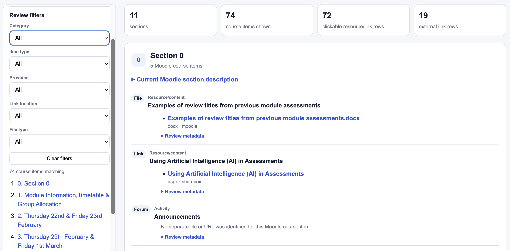

# CloudPedagogy Moodle Course Analysis Platform

A local-first Python toolkit for analysing Moodle course backup (`.mbz`) files. It can generate structured audit reports and datasets, interactive dashboards, organised copies of Moodle-hosted files, editable course content maps, detailed settings reports, and before/after course comparisons.

The source Moodle backup is read but not modified.

## Overview

The recommended entry point is `src/orchestrator.py`. It runs the appropriate scripts for the workflow you request and understands dependencies between them.

```text
                                  Moodle .mbz
                                      |
                    +-----------------+------------------+
                    |                 |                  |
                    v                 v                  v
                  Auditor          Extractor      Settings analyser
                    |                 |                  |
                    v                 |                  |
                Dashboard             |                  |
                    |                 |                  |
                    +--------+--------+                  |
                             |                           |
                             v                           |
                       Content mapper                    |
                                                         |
     Before .mbz + After .mbz --> Comparator             |
```

The **content mapper is dependency-aware**: it does not read an `.mbz` directly. It requires the auditor outputs plus the extracted files. When `--content-map` is requested, the orchestrator automatically runs the required audit and extraction stages first.

The comparator is deliberately separate because it requires an explicit **before** and **after** backup.

## Components

| Script | Purpose | Reads |
|---|---|---|
| `src/orchestrator.py` | Recommended controller for one or many backups. Selects and runs the required workflow, manages dependencies, output folders, logging and batch status. | One `.mbz` or a folder of `.mbz` files |
| `src/moodle_mbz_course_auditor.py` | Main Moodle metadata audit. Produces reports, CSV datasets and JSON covering structure, activities, Books, files, media, external dependencies, permissions and other evidence. | `.mbz` |
| `src/moodle_dashboard_generator.py` | Creates the interactive HTML analytics dashboard from auditor outputs. | Audit folder |
| `src/extract_moodle_files.py` | Reconstructs Moodle-hosted files and organises them by Moodle context, course structure and/or file type. | `.mbz` |
| `src/content_mapper.py` | Creates a browsable HTML content map, editable Word map and CSV mapping outputs. | Auditor outputs + `extracted_files/` |
| `src/analyse_mbz.py` | Detailed activity/settings analyser covering display modes, visibility, groups, completion, restrictions, file metadata, role overrides and optional domain review rules. | `.mbz` |
| `src/compare_mbz.py` | Compares an earlier and later Moodle backup for structural, configuration, content, Book chapter and file changes. | Two `.mbz` files |

The tools remain independently runnable. The orchestrator coordinates them; it does not replace their internal logic.

## Key capabilities

- Process one Moodle backup or many backups sequentially.
- Inventory sections, activities, resources, Moodle Books and uploaded files.
- Analyse file formats, sizes, storage footprint and largest files.
- Distinguish Moodle-hosted video from Panopto and other external media.
- Review hidden, old and potentially duplicated content.
- Identify external domains and platform dependencies.
- Report explicit course- and activity-level role capability overrides and recorded enrolment methods.
- Generate responsive Plotly dashboards.
- Recover and organise Moodle-hosted files.
- Produce clickable HTML and editable Word course content maps.
- Produce detailed settings reports.
- Compare two Moodle backups and identify meaningful changes.
- Record per-stage success, warnings and failures in `batch_summary.csv`.

The platform is an evidence-gathering tool. It does not assign pedagogic-quality, accessibility, compliance or risk scores.

See [`HANDBOOK.md`](HANDBOOK.md) for detailed workflows, script outputs, dependencies, interpretation guidance and troubleshooting.

## Example outputs

### Sample dashboard visualisations

<p align="center">
  
</p>

<p align="center"><em>Sample data visualisation — screenshot 1.</em></p>

<p align="center">
  
</p>

<p align="center"><em>Sample data visualisation — screenshot 2.</em></p>

<p align="center">
  
</p>

<p align="center"><em>Sample data visualisation — screenshot 3.</em></p>

### Extracted Moodle resources

<p align="center">
  
</p>

<p align="center"><em>Example of Moodle-hosted files reconstructed from an MBZ backup.</em></p>

### HTML course content mapping

The content mapper generates a browsable HTML representation of the Moodle course structure, with filtering, links to recovered Moodle-hosted resources, external links and expandable review metadata.

<p align="center">
  
</p>

<p align="center"><em>Example HTML course content map generated from the audited course structure and extracted resources.</em></p>

> Screenshots are illustrative. Available reports, dashboard panels and extracted resources depend on the course and Moodle backup selections.

## Repository structure

```text
cloudpedagogy-moodle-course-auditor/
|-- README.md
|-- HANDBOOK.md
|-- MOODLE_BACKUP_INSTRUCTIONS.md
|-- requirements.txt
|-- LICENSE
|-- src/
|   |-- orchestrator.py
|   |-- moodle_mbz_course_auditor.py
|   |-- moodle_dashboard_generator.py
|   |-- extract_moodle_files.py
|   |-- content_mapper.py
|   |-- analyse_mbz.py
|   `-- compare_mbz.py
|-- batch_input/       # Put one or more .mbz files here
`-- batch_output/      # Generated orchestrator results
```

`batch_input` and `batch_output` are the default folder names used by the orchestrator.

## Requirements

- Python 3.10 or later
- Python 3.13 is recommended for the current project environment
- Dependencies from `requirements.txt`:
  - pandas
  - Plotly
  - python-docx

## Installation

From the repository root:

```bash
python3 -m venv .venv
source .venv/bin/activate
python3 -m pip install --upgrade pip
python3 -m pip install -r requirements.txt
```

On Windows PowerShell:

```powershell
py -3 -m venv .venv
.\.venv\Scripts\Activate.ps1
python -m pip install --upgrade pip
python -m pip install -r requirements.txt
```

Confirm the orchestrator:

```bash
python3 src/orchestrator.py --version
python3 src/orchestrator.py --help
```

## Recommended Moodle backup selections

Create a normal Moodle `.mbz` backup, not an IMS Common Cartridge export. For a normal structural/content audit, include:

- activities and resources;
- files;
- blocks;
- filters;
- custom fields;
- content-bank content where relevant;
- legacy course files where relevant;
- question bank if question analysis is required.

Normally exclude enrolled users, user role assignments, logs, grades, completion details and other learner data unless there is a specific authorised reason to include them.

See [`MOODLE_BACKUP_INSTRUCTIONS.md`](MOODLE_BACKUP_INSTRUCTIONS.md) for the full selection guide.

## Quick start

Put one or more `.mbz` files into `batch_input/`.

### Standard audit and dashboard

```bash
source .venv/bin/activate
python3 src/orchestrator.py
```

Because `batch_input` and `batch_output` are defaults, no paths are required.

### Audit, dashboard and extracted files

```bash
python3 src/orchestrator.py --extract-files
```

### Audit, analytics, extraction and course content map

```bash
python3 src/orchestrator.py --content-map
```

`--content-map` automatically enables extraction because the mapper requires both the audit outputs and `extracted_files/`.

### Audit, dashboard and detailed settings analysis

```bash
python3 src/orchestrator.py --settings
```

### Full per-course workflow

```bash
python3 src/orchestrator.py --full
```

This requests:

```text
Auditor
Dashboard
Extractor
Content mapper
Settings analyser
```

### Explicit input/output paths

```bash
python3 src/orchestrator.py batch_input --output-dir batch_output --content-map
```

## Typical orchestrator output

For `literature-review-2025.mbz`:

```text
batch_output/
|-- batch_summary.csv
`-- literature-review-2025/
    |-- audit/
    |   |-- audit_report.md
    |   |-- audit_report.txt
    |   |-- audit_data.json
    |   `-- generated CSV datasets
    |-- dashboard.html
    |-- processing.log
    |-- extracted_files/       # with --extract-files / --content-map / --full
    |-- content_map/           # with --content-map / --full
    |   |-- index.html
    |   |-- content_map.docx
    |   |-- content_map.csv
    |   |-- unresolved_items.csv
    |   `-- mapping_report.md
    `-- settings/              # with --settings / --full
        |-- course-settings-report.html
        |-- course-settings.csv
        `-- course-settings.json
```

## Content mapper dependency

`content_mapper.py` cannot run directly from a Moodle backup. It requires:

```text
<course-run>/
|-- audit/
|   |-- sections.csv
|   |-- activities.csv
|   `-- content_placement_inventory.csv
`-- extracted_files/
```

The orchestrator checks these prerequisites before running the mapper. If you request:

```bash
python3 src/orchestrator.py --content-map
```

the required extraction stage is enabled automatically.

## Course comparison

Comparison remains a separate workflow because it requires a deliberate before/after pair:

```bash
python3 src/compare_mbz.py \
  before.mbz \
  after.mbz \
  --output-dir comparison_output
```

Typical outputs include:

- `comparison_report.html`
- `comparison_report.md`
- `comparison_data.json`
- `course_changes.csv`
- `activity_changes.csv`
- `content_changes.csv`
- `file_changes.csv`

## Existing results

The default policy preserves previous results by adding `_2`, `_3`, etc.

```bash
python3 src/orchestrator.py --existing suffix
```

Other options:

```bash
python3 src/orchestrator.py --existing skip
python3 src/orchestrator.py --existing overwrite
```

Use `overwrite` deliberately because it removes the matching generated course-run folder before rebuilding it.

## Data protection

Moodle backups and generated outputs can contain sensitive or copyrighted material. Process only data you are authorised to use, minimise learner data, store inputs and results securely, and do not commit real `.mbz` files, extracted content or sensitive reports to a public repository.

Recommended `.gitignore` entries:

```gitignore
*.mbz
batch_input/*
!batch_input/.gitkeep
batch_output/*
!batch_output/.gitkeep
.venv/
__pycache__/
```

## Limitations

The main auditor analyses Moodle XML and file metadata. It does not semantically interpret the contents of uploaded PDFs, Word documents, PowerPoints, images, audio/video, SCORM packages or H5P packages.

Findings depend on the Moodle version, plugins, backup selections and metadata conventions. Important findings should be checked against the source Moodle course before consequential action.

## Licence

MIT License
