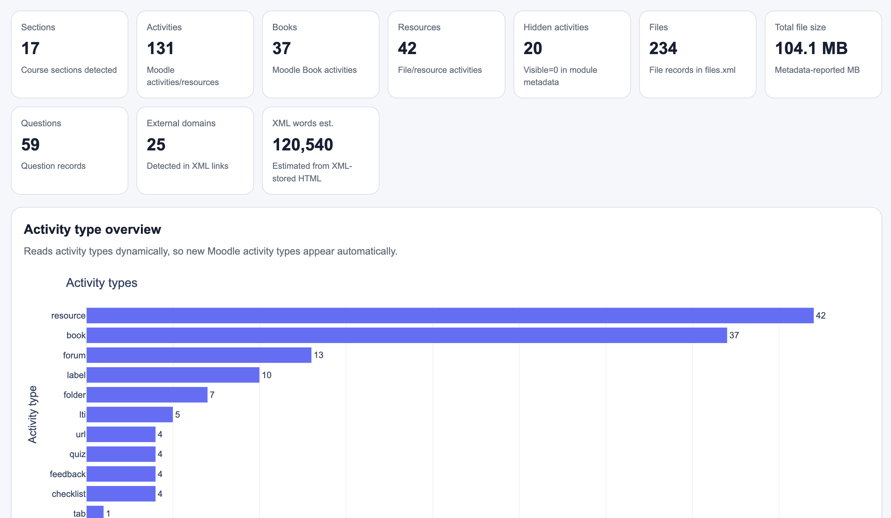
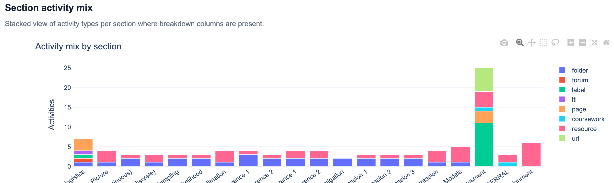
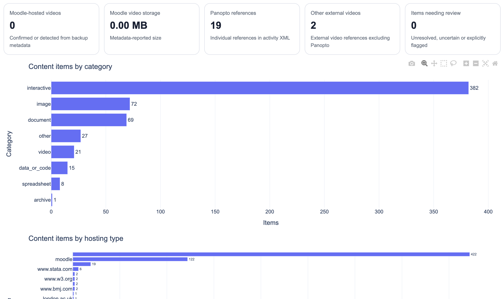
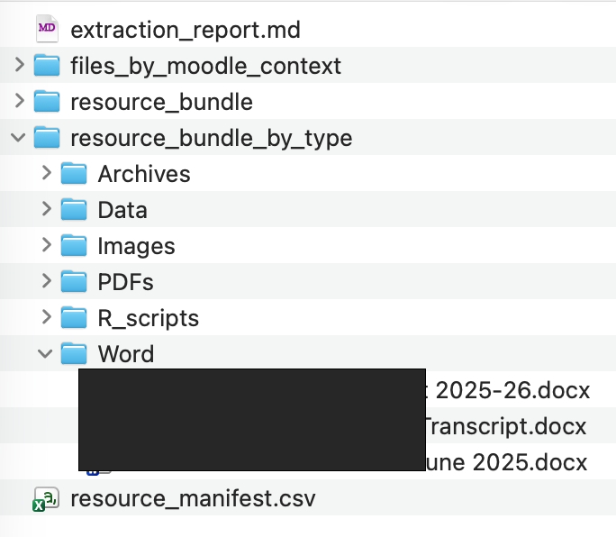
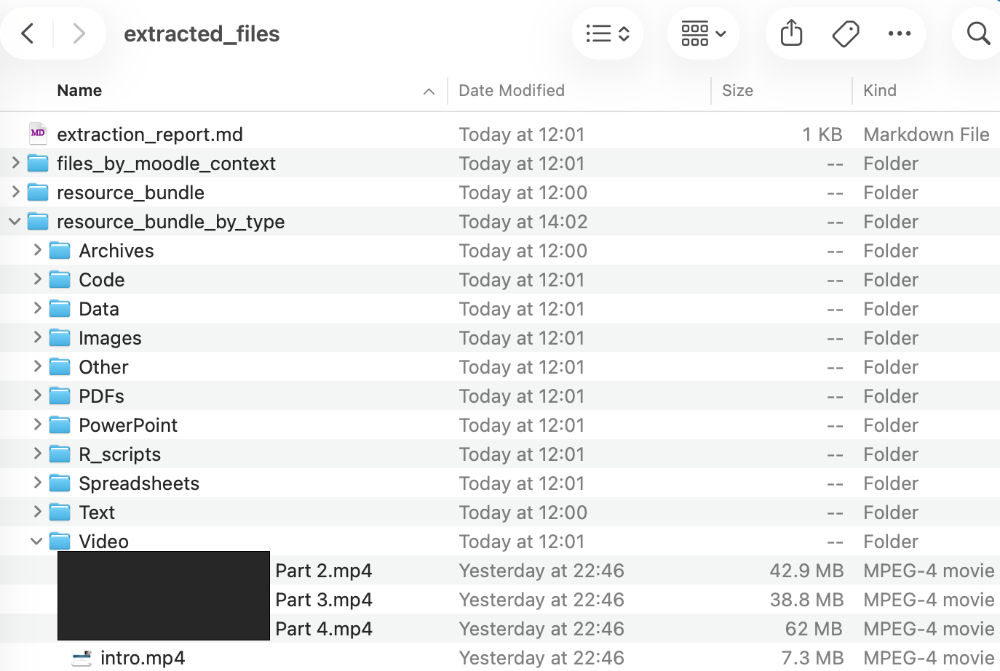

# CloudPedagogy Moodle Course Analysis Platform

A local-first Python toolkit that turns Moodle course backups into structured audit reports, reusable datasets, interactive HTML dashboards and, when requested, organised copies of Moodle-hosted files. It works without access to a live Moodle site and does not alter the source backup.

## Components

| Script | Role |
|---|---|
| `src/moodle_mbz_course_auditor.py` | Analyses Moodle backup XML and file metadata and creates reports, CSV files and JSON data. |
| `src/moodle_dashboard_generator.py` | Converts one audit dataset into a standalone interactive `dashboard.html`. |
| `src/extract_moodle_files.py` | Optionally reconstructs Moodle-hosted files using `files.xml` and the backup content store. |
| `src/batch_audit.py` | Runs the complete workflow for either one `.mbz` or every `.mbz` in a folder. |

The auditor is deliberately conservative: it reports evidence contained in the backup and does not assign pedagogic-quality, accessibility, compliance or risk scores.

## Key capabilities

- Process one backup or several backups sequentially.
- Inventory course structure, sections, activities, resources and Moodle Books.
- Identify hidden content and possible duplicate activities.
- Summarise questions, modification dates and estimated XML text volume.
- Analyse files, formats, sizes, storage footprint and largest files.
- Distinguish Moodle-hosted video from Panopto and other external-video references.
- Detect external links, domains, iframes and other platform dependencies.
- Report explicit course- and activity-level role capability overrides, together with enrolment methods recorded in the backup.
- Generate CSV, JSON, Markdown and text outputs.
- Generate a responsive standalone Plotly dashboard.
- Optionally export actual Moodle-hosted files into organised folders.
- Continue to later backups if an individual backup fails and record each outcome.

See [`HANDBOOK.md`](HANDBOOK.md) for the full operational guide, interpretation guidance, output catalogue, limitations and troubleshooting.


## Example outputs

The platform generates structured audit datasets, an interactive dashboard and, when requested, organised copies of Moodle-hosted resources.


### Sample dashboard visualisations

The following images are sample screenshots from the automatically generated interactive HTML dashboard.

<p align="center">
  
</p>

<p align="center"><em>Sample data visualisation — screenshot 1.</em></p>

<p align="center">
  
</p>

<p align="center"><em>Sample data visualisation — screenshot 2.</em></p>

<p align="center">
  
</p>

<p align="center"><em>Sample data visualisation — screenshot 3.</em></p>

### Extracted Moodle resources

When optional file extraction is enabled, Moodle-hosted resources—such as PDFs, Word documents, presentations, images and videos—are reconstructed in organised folders.

<p align="center">
  
</p>

<p align="center"><em>Example of Moodle-hosted files reconstructed from an MBZ backup.</em></p>

### Audit datasets

The auditor extracts structured information from the Moodle `.mbz` backup and generates CSV, JSON, Markdown and text files for further analysis.

<p align="center">
  
</p>

<p align="center"><em>Generated audit datasets available for further analysis.</em></p>

> These screenshots are illustrative. Available reports, dashboard panels and extracted resources depend on the course content and Moodle backup selections.


## Recommended repository structure

```text
cloudpedagogy-moodle-course-auditor/
|-- README.md
|-- HANDBOOK.md
|-- requirements.txt
|-- src/
|   |-- batch_audit.py
|   |-- moodle_mbz_course_auditor.py
|   |-- moodle_dashboard_generator.py
|   `-- extract_moodle_files.py
|-- batch_input/       # Put one or more .mbz files here
`-- batch_output/      # Generated results
```

The folder names are not hard-coded. You may use different names if the command uses the corresponding paths.

## Requirements

- Python 3.10 or later (Python 3.13 is recommended for the current project environment)
- Dependencies listed in `requirements.txt`

The auditor, controller and extractor primarily use the Python standard library. The dashboard generator requires Plotly and may require additional packages if listed by the version of the generator supplied with the repository.

## Installation

From the repository root:

```bash
python3.13 -m venv .venv
source .venv/bin/activate
python -m pip install --upgrade pip
python -m pip install -r requirements.txt
mkdir -p batch_input batch_output
```

On Windows PowerShell, activate the environment with:

```powershell
.\.venv\Scripts\Activate.ps1
```

## Recommended Moodle backup selections

Create a normal Moodle `.mbz` backup rather than an IMS Common Cartridge export. Include:

- activities and resources;
- files;
- blocks;
- filters;
- custom fields;
- content-bank content where relevant;
- legacy course files where relevant;
- question bank if question analysis is required.

Normally exclude enrolled users, user roles, comments, badges, calendar events, logs, grade history, completion details and other user data unless there is a specific authorised reason to include them. Keep every section and activity that should appear in the audit on the Schema settings page.

Excluding individual user role assignments does not prevent the auditor from reporting high-level capability overrides saved in course- and activity-level `roles.xml` files. The permissions analysis does not require learner identities.

Excluded material cannot be analysed. In particular, excluding files can result in incomplete storage figures and an apparent zero Moodle-hosted-video count.

## Quick start: complete workflow

Place one or more `.mbz` files in `batch_input/`, then run:

```bash
source .venv/bin/activate
python src/batch_audit.py batch_input --output-dir batch_output
```

The same command works for one backup or many. Backups are sorted and processed sequentially.

To include copies of Moodle-hosted files and verify their SHA-1 hashes:

```bash
python src/batch_audit.py batch_input \
  --output-dir batch_output \
  --extract-files \
  --verify-hashes
```

Extraction is disabled by default because it increases storage use and creates additional copies of course content.

## Output structure

For:

```text
backup-moodle2-course-5729-lshtm_2489_2025-20260731-2245-nu.mbz
```

the controller creates:

```text
batch_output/
|-- batch_summary.csv
`-- 5729-lshtm_2489_2025-20260731-2245/
    |-- audit/
    |   |-- audit_report.md
    |   |-- audit_report.txt
    |   |-- audit_data.json
    |   `-- generated CSV files
    |-- dashboard.html
    |-- processing.log
    `-- extracted_files/       # Only with --extract-files
```

The folder name retains the Moodle course ID, recognisable course name/year and backup timestamp. This is clearer and safer than using only the course ID.

## Existing results

The default preserves earlier output by adding `_2`, `_3` and so on:

```bash
python src/batch_audit.py batch_input --output-dir batch_output --existing suffix
```

Skip an existing course-run folder:

```bash
python src/batch_audit.py batch_input --output-dir batch_output --existing skip
```

Replace an existing result deliberately:

```bash
python src/batch_audit.py batch_input --output-dir batch_output --existing overwrite
```

`overwrite` removes the selected existing course-run output before rebuilding it. Retain historical results elsewhere if comparison is required.

## Running individual tools

Audit one backup:

```bash
python src/moodle_mbz_course_auditor.py course.mbz \
  --output-dir output/course_audit
```

Generate its dashboard:

```bash
python src/moodle_dashboard_generator.py output/course_audit
```

Extract its Moodle-hosted files independently:

```bash
python src/extract_moodle_files.py course.mbz \
  --output output/extracted_files \
  --mode all \
  --verify-hashes
```

Always check the interface for the version installed:

```bash
python src/batch_audit.py --help
python src/moodle_mbz_course_auditor.py --help
python src/moodle_dashboard_generator.py --help
python src/extract_moodle_files.py --help
```

## What the dashboard shows

Depending on the available audit data, the dashboard can show:

- headline course, section, activity, file and storage totals;
- activity types and section distributions;
- Moodle Book and chapter summaries;
- visible and hidden content;
- file formats, largest files and storage footprint;
- Moodle-hosted videos and their total storage;
- unique Panopto and other external-video references;
- hosting locations, providers and content formats;
- external domains and dependencies;
- explicit course- and activity-level role capability overrides, including `Allow`, `Prevent` and `Prohibit` decisions;
- roles affected and enrolment methods recorded in the backup;
- dynamically worded Student-restriction prompts derived from recognised capability names;
- content placements, confidence and review items;
- activity modification-age summaries;
- a filterable content inventory.

Panels without supporting data may be omitted. The dashboard visualises the audit outputs; it does not perform a separate analysis.

### Permission outputs

The permissions feature creates two datasets:

- `course_permissions.csv` — one row per explicit capability override, including its context, role, capability, decision and review flag;
- `course_access_summary.csv` — summary counts for course-level and activity-level overrides, affected roles, `Allow`/`Prevent`/`Prohibit` decisions, important Student restrictions and enrolment methods.

The dashboard's **Course access and permissions** panel provides a compact overview and an expandable evidence table. When recognised Student capabilities are explicitly restricted, its warning is derived dynamically from those capabilities—for example, forum participation, quiz participation or resource access. Unrecognised or mixed uncertain cases use a conservative generic description.

These findings are particularly useful for identifying unexpected participation restrictions, explaining behaviour that differs from Moodle defaults, reviewing local role customisation before rollover or redesign, comparing course configurations, and supporting troubleshooting. They should always be interpreted with the live Moodle configuration when decisions are consequential.

## Limitations

The auditor reads Moodle XML and file metadata. It does not interpret the internal contents of PDFs, Word documents, PowerPoint files, images, audio, video, SCORM packages or H5P packages.

It does not automatically:

- judge pedagogic quality or academic accuracy;
- assess curriculum alignment or learner understanding;
- perform a full accessibility or copyright audit;
- test whether external URLs remain available;
- generate compliance, risk or severity ratings.

Results describe only the evidence included in the backup. A zero may mean either that no matching content was found or that the relevant data was excluded. Unusual third-party plugins may use structures the auditor does not recognise. XML word counts and modification ages must be interpreted as indicators, not definitive measures of learner workload or content currency.

Permission findings represent explicit role capability overrides and enrolment information stored in the course backup. They are not a complete Moodle permission matrix. Capabilities not listed normally inherit site-level role definitions and wider Moodle configuration, which may not be included in the `.mbz`. `Prevent` and `Prohibit` also have different Moodle inheritance behaviour; the dashboard reports the recorded decision but does not simulate every effective permission for every user.

## Data protection

Moodle backups and extracted files can contain personal, sensitive or copyrighted material. Analyse only data you are authorised to use; minimise user data in backups; store inputs and outputs securely; follow institutional retention policies; and never commit real `.mbz` files, extracted course files or sensitive outputs to a public repository.

Recommended `.gitignore` entries:

```gitignore
*.mbz
batch_input/*
!batch_input/.gitkeep
batch_output/*
!batch_output/.gitkeep
.venv/
__pycache__/
```

## Disclaimer

Reasonable care is taken in classification, but results may be incomplete or occasionally misclassified because Moodle versions, plugins, backup selections and metadata conventions vary. Review important findings against the live course or source materials before consequential decisions are made.

The platform supports professional review; it does not replace academic judgement, learning-design review, accessibility testing, quality-assurance procedures, data-protection review or Moodle administration.

## Licence

MIT License
